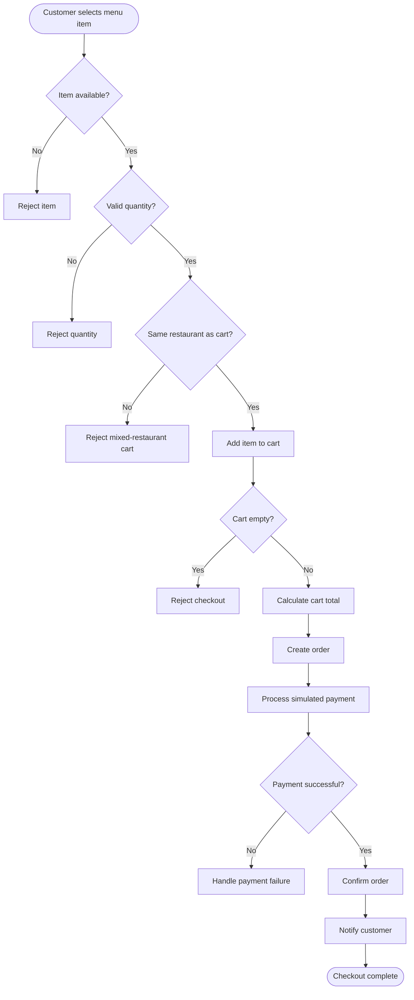

# FoodFlow — Checkout Flow

```mermaid
flowchart TD
    A([Customer selects menu item]) --> B{Item available?}
    B -- No --> C[Reject item]
    B -- Yes --> D{Valid quantity?}
    D -- No --> E[Reject quantity]
    D -- Yes --> F{Same restaurant as cart?}
    F -- No --> G[Reject mixed-restaurant cart]
    F -- Yes --> H[Add item to cart]
    H --> I{Cart empty?}
    I -- Yes --> J[Reject checkout]
    I -- No --> K[Calculate cart total]
    K --> L[Create order]
    L --> M[Process simulated payment]
    M --> N{Payment successful?}
    N -- No --> O[Handle payment failure]
    N -- Yes --> P[Confirm order]
    P --> Q[Notify customer]
    Q --> R([Checkout complete])
```
