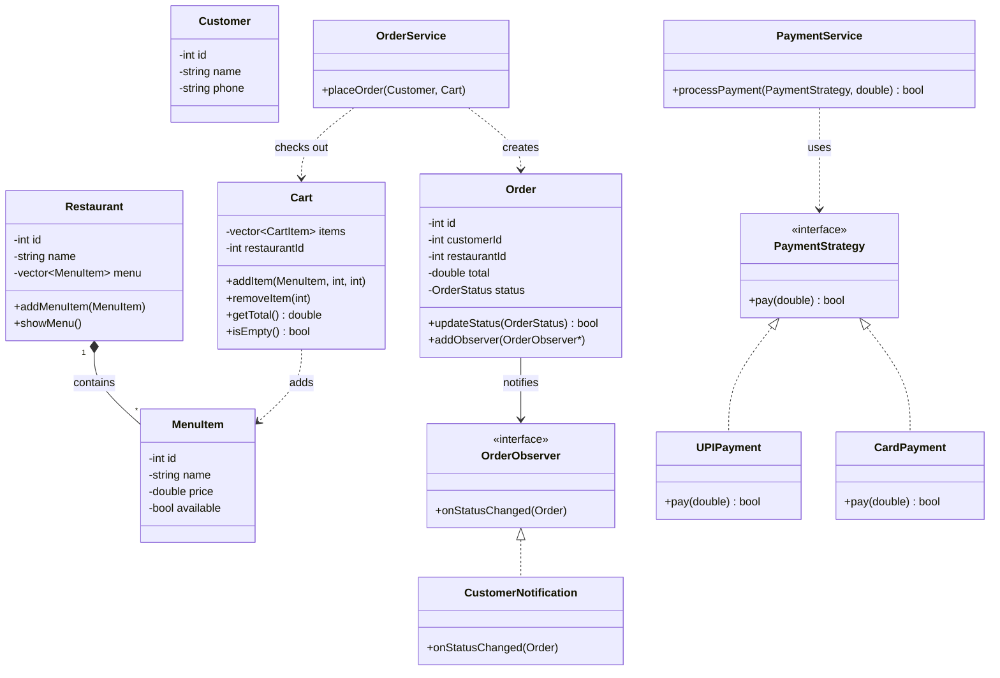

# FoodFlow — UML Class Diagram

```mermaid
classDiagram
    class MenuItem {
        -int id
        -string name
        -double price
        -bool available
    }

    class Restaurant {
        -int id
        -string name
        -vector~MenuItem~ menu
        +addMenuItem(MenuItem)
        +showMenu()
    }

    class Customer {
        -int id
        -string name
        -string phone
    }

    class Cart {
        -vector~CartItem~ items
        -int restaurantId
        +addItem(MenuItem, int, int)
        +removeItem(int)
        +getTotal() double
        +isEmpty() bool
    }

    class Order {
        -int id
        -int customerId
        -int restaurantId
        -double total
        -OrderStatus status
        +updateStatus(OrderStatus) bool
        +addObserver(OrderObserver*)
    }

    class OrderService {
        +placeOrder(Customer, Cart)
    }

    class PaymentStrategy {
        <<interface>>
        +pay(double) bool
    }

    class UPIPayment {
        +pay(double) bool
    }

    class CardPayment {
        +pay(double) bool
    }

    class PaymentService {
        +processPayment(PaymentStrategy, double) bool
    }

    class OrderObserver {
        <<interface>>
        +onStatusChanged(Order)
    }

    class CustomerNotification {
        +onStatusChanged(Order)
    }

    Restaurant "1" *-- "*" MenuItem : contains
    Cart ..> MenuItem : adds
    OrderService ..> Cart : checks out
    OrderService ..> Order : creates
    PaymentService ..> PaymentStrategy : uses
    PaymentStrategy <|.. UPIPayment
    PaymentStrategy <|.. CardPayment
    OrderObserver <|.. CustomerNotification
    Order --> OrderObserver : notifies
```
